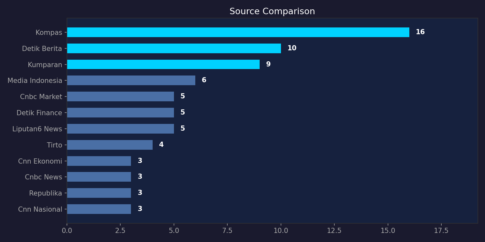
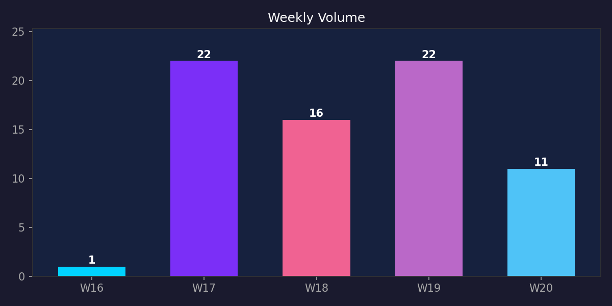
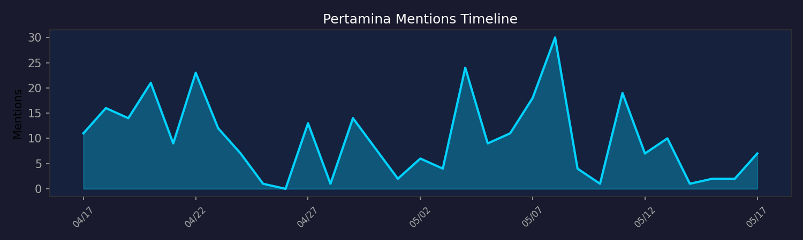
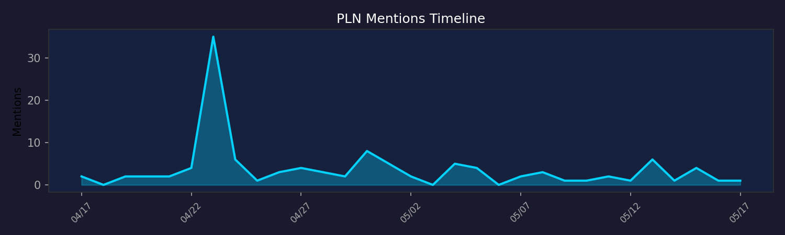
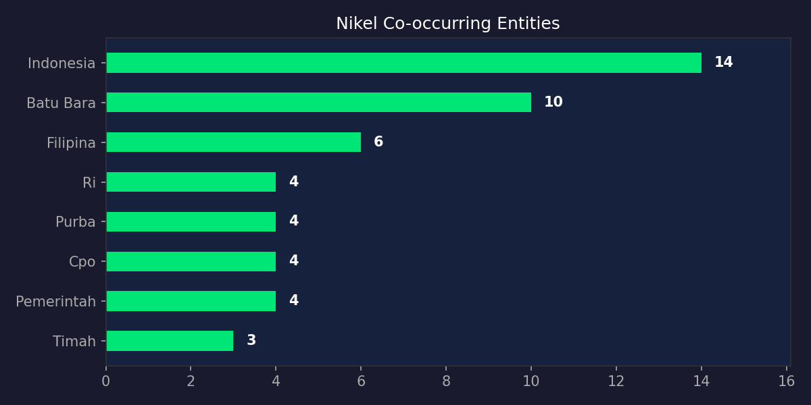
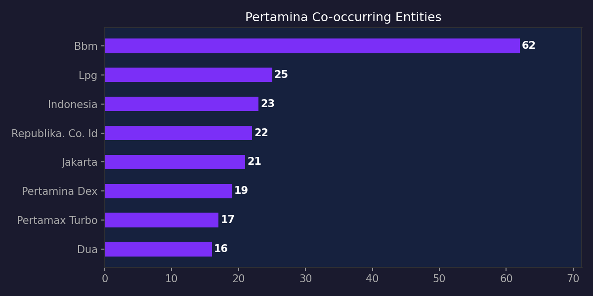

# Transisi Energi Hijau di Indonesia (v2)

**Periode:** 17 April – 17 Mei 2026
**Sumber:** Semantik API (keyword-filtered) — 72 artikel dari 12 media nasional
**Kata kunci:** transisi energi, energi hijau, EBT, energi baru terbarukan
**Scope:** Keyword-filtered (bukan channel-level)

> **Catatan metodologi:** V1 menggunakan channel-level Lingkungan (2.264 artikel — termasuk pertambangan, nikel, batu bara, IKN, deforestasi). V2 menggunakan keyword-filtered endpoints — hanya 72 artikel yang benar-benar relevan secara spesifik.

---

## Perbandingan V1 vs V2

| Metrik            | V1 (Channel)   | V2 (Keyword) |
|-------------------|:--:|:--:|
| Total Artikel     | 2.264 | 72 |
| Sumber Media      | 14 | 12 |
| Metode            | `channel=Lingkungan` | `topic_keywords=...` |
| Cakupan           | Seluruh isu lingkungan | Spesifik transisi energi |

---

## Ringkasan

Dari 72 artikel yang secara spesifik membahas transisi energi hijau di Indonesia selama sebulan, mayoritas pemberitaan berpusat pada **Pertamina** (307 sebutan, sentimen +2.76) — tetapi hampir semua framing-nya tentang BBM dan harga energi, bukan transisi hijau. **PLN** mendapat sentimen negatif (−1.03) karena pemadaman listrik Jakarta. **Prabowo** mendapat sorotan positif (+1.45) lewat pengumuman PLTS 100 GW.

---

## 1. Volume & Sumber

Distribusi dari 12 sumber:

- Kompas: 16 artikel
- Detik Berita: 10
- Kumparan: 9
- Media Indonesia: 6
- CNBC Market: 5
- Detik Finance: 5
- Liputan6 News: 5
- Tirto: 4
- CNN Ekonomi: 3
- CNBC News: 3
- Republika: 3
- CNN Nasional: 3

**Volume Mingguan:**

- W16 (13-19 Apr): 1 artikel
- W17 (20-26 Apr): 22 artikel — **puncak tertinggi**
- W18 (27 Apr - 3 Mei): 16 artikel
- W19 (4-10 Mei): 22 artikel — **puncak kedua**
- W20 (11-17 Mei): 11 artikel

---

## 2. Sentimen Entitas

| Entitas   | Positif | Negatif | Rata-rata |
|-----------|:---:|:---:|:---:|
| Pertamina | 277 | 132 | **+2.76** |
| PLN       | 71  | 93  | **−1.03** |
| Prabowo   | 1.707 | 1.138 | **+1.45** |

**Pertamina** — sentimen paling positif. Tapi ini mencerminkan pemberitaan BBM dan operasional, bukan transisi energi.

**PLN** — sentimen negatif karena pemadaman listrik Jakarta (22-24 April). Bukan karena kegagalan transisi.

**Prabowo** — positif dalam konteks energi (PLTS 100 GW, KTT ASEAN), meski angka 2.109 sebutan mencakup semua pemberitaan tentang beliau.

---

## 3. Timeline

### Pertamina

Puncak 17-19 April (10-16 sebutan/hari) — kenaikan BBM nonsubsidi per 18 April. Lonjakan kedua 7-9 Mei — KTT ASEAN dan kerja sama energi RI-Rusia.

### PLN

Puncak 22-24 April (6-7 sebutan/hari) — pemadaman listrik massal Jakarta. PLN mendapat sorotan saat krisis, bukan inisiatif hijau.

---

## 4. Ko-okurensi Entitas

### Nikel — Jembatan Transisi

| Entitas   | Ko-okurensi |
|-----------|:----:|
| Indonesia | 14 |
| Batu bara | 10 |
| Filipina  | 6 |
| CPO       | 4 |
| Pemerintah | 4 |

Nikel berada di persimpangan antara transisi energi (baterai EV) dan ekonomi ekstraktif (batu bara, CPO).

### Pertamina

| Entitas        | Ko-okurensi |
|----------------|:----:|
| BBM            | 62 |
| LPG            | 25 |
| Indonesia      | 23 |
| Jakarta        | 21 |
| Pertamina Dex  | 19 |

Ko-okurensi Pertamina didominasi produk BBM — **hampir nihil hubungan dengan transisi hijau**.

---

## 5. Framing

### Pertamina — BBM Bukan Hijau

Framing Pertamina dari 13 sumber semuanya tentang harga BBM, operasional, dan kasus korupsi. Tidak ada framing Pertamina sebagai pemimpin transisi energi hijau.

### PLN — Krisis vs Transisi

Framing PLN terbelah:
- **Negatif:** Listrik padam Jakarta, 76 gardu induk gangguan, tarif listrik
- **Positif:** Pemulihan 100% sistem, PLTS Offgrid, cofiring biomassa, green mining

### Prabowo — Narasi Optimisme

Framing Prabowo dalam energi: PLTS 100 GW, kerja sama nuklir RI-Rusia, hilirisasi Rp116 T, KTT ASEAN. Semua narasi positif tapi masih di level pengumuman — belum realisasi.

---

## 6. Jaringan Relasi

Dari `relations/network` (cross-channel, 222 nodes, 200 edges), energi-related edges sangat sedikit:

- rupiah → melemah terhadap → dolar as (22)
- LPG → naik menjadi → Rp7.200 (3)

Endpoint `relations/network` bersifat agregat cross-channel — tidak ideal untuk analisis topik spesifik.

---

## 7. Temuan Kunci

### V1 vs V2: Mengapa Ini Penting

**V1 report** menggunakan channel-level Lingkungan dan menyajikan 2.264 artikel sebagai data transisi energi hijau. Kenyataannya, hanya **72 artikel (3%)** yang benar-benar mengandung kata kunci spesifik.

Data yang salah scope menghasilkan:
- Angka sentimen yang bias (campuran isu tambang, IKN, deforestasi)
- Volume yang sangat menyesatkan (31x lipat)
- Entity list berisi "Inter Milan" dan "debt collector" — tidak relevan

### Temuan Analisis yang Sahih

1. **Volume transisi energi hijau sangat rendah** — 72 artikel/bulan dari 12 media nasional. Ini menandakan bahwa transisi energi hijau belum menjadi prioritas pemberitaan.

2. **Pertamina dominan tapi tidak hijau** — entitas paling disebut dalam pemberitaan energi, tapi framing-nya tentang BBM, LPG, dan harga. Pertamina tidak dibingkai sebagai agen transisi.

3. **Nikel ambigu** — di satu sisi komoditas masa depan (baterai EV), di sisi lain terkait erat dengan batu bara dan ekstraksi sumber daya.

4. **Optimisme dari pidato** — narasi positif datang dari pengumuman Prabowo, bukan laporan realisasi lapangan.

5. **PLN negatif karena krisis teknis** — sentimen buruk bukan dari kebijakan transisi, tapi pemadaman listrik.

### Rekomendasi

1. **Perluas keyword** — tambahkan "energi surya", "geothermal", "PLTS", "PLTA", "biomassa", "cofiring", "CCS", "karbon"
2. **Rentang waktu lebih panjang** — 6-12 bulan untuk volume data meaningful
3. **Kombinasikan scope** — channel-level untuk sentimen makro, keyword-filtered untuk presisi
4. **API relations/network** kurang ideal untuk topik spesifik — gunakan `entities/{word}/cooccurrence` untuk analisis yang fokus

---

## Data

Data mentah di `data/`:
- `source_comparison.json`
- `topic_trend.json`
- `{entitas}_sentiment.json`
- `{entitas}_timeline.json`
- `{entitas}_cooccurrence.json`
- `{entitas}_framing.json`
- `top_relations.json`
- `network.json`

---

*Dibuat dengan Hermes Agent via Semantik API. Notebook: `transisi-energi-hijau-2026.ipynb`.*
*Metodologi: Keyword-filtered endpoints + entity-level endpoints. 17 Apr – 17 Mei 2026.*