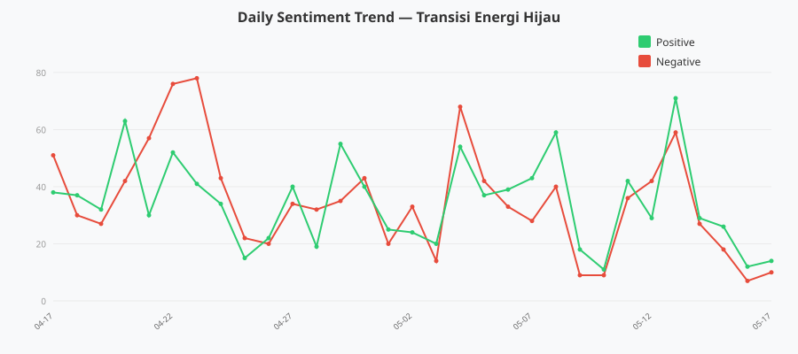
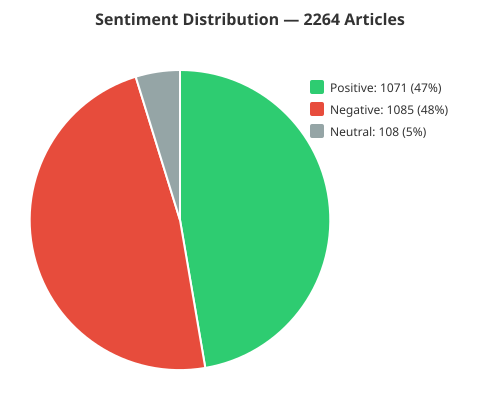
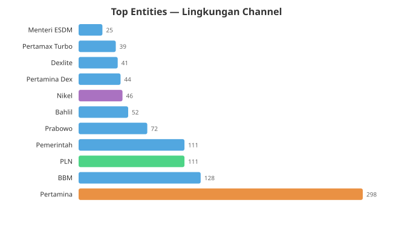

# Transisi Energi Hijau di Indonesia

**Periode:** 17 April – 17 Mei 2026
**Sumber:** Semantik (Lingkungan channel) — 2.264 artikel dari 13 media nasional
**Kata kunci:** transisi energi, energi hijau, EBT, energi baru terbarukan

---

## Ringkasan

Dalam sebulan terakhir, pemberitaan tentang transisi energi hijau di Indonesia hampir terbelah dua — 47% positif vs 48% negatif. Puncak volume terjadi pada minggu ketiga April (56 artikel), didorong oleh pemberitaan BBM dan kebijakan energi. Narasi positif menguat kembali pada 8–13 Mei seiring pengumuman ambisius Prabowo tentang PLTS 100 GW di KTT ASEAN dan kerja sama energi regional.





---

## 1. Analisis Sentimen

### Distribusi Keseluruhan

| Sentimen | Jumlah Artikel | Persentase |
|----------|:-:|:-:|
| Positif | 1.071 | 47% |
| Negatif | 1.085 | 48% |
| Netral | 108 | 5% |
| **Total** | **2.264** | **100%** |

Pemberitaan hampir seimbang. Negatif sedikit unggul, tetapi dominasi tidak signifikan.

### Tren Harian

Beberapa lonjakan penting:

- **22–23 April** — Dua hari paling negatif (76 dan 78 artikel negatif). Tidak ada momen positif tunggal yang menandingi puncak ini. Pemberitaan didominasi isu BBM nonsubsidi dan kenaikan harga energi.
- **20 April** — Volume tertinggi (105 artikel), dengan 63 positif vs 42 negatif. Kemungkinan didorong oleh respons positif terhadap kebijakan energi baru.
- **13 Mei** — Hari paling positif (71 positif vs 59 negatif). Bertepatan dengan pengumuman PLTS 100 GW Prabowo dan forum Asia Carbon Capture 2026.
- **Akhir pekan (9–10 Mei, 16–17 Mei)** — Volume turun drastis (di bawah 30 artikel/hari), pola normal untuk akhir pekan.

### Varian Media

| Media | Artikel | Rata-rata Sentimen | Kecenderungan |
|-------|:-:|:-:|:-:|
| CNN Ekonomi | 8 | +5.75 | Paling positif |
| Tempo Bisnis | 3 | +8.00 | Positif (energi bersih) |
| Media Indonesia | 21 | +4.33 | Cenderung positif |
| Republika | 11 | +3.27 | Cenderung positif |
| CNBC News | 15 | +2.07 | Cenderung positif |
| Detik Finance | 9 | +1.89 | Netral-positif |
| Kompas | 27 | −0.48 | Netral (volume tertinggi) |
| Detik Berita | 17 | −1.94 | Cenderung negatif |
| Kumparan | 16 | −2.31 | Cenderung negatif |
| Liputan6 | 8 | −6.38 | Paling negatif |

**Pola:** Media bisnis (CNN Ekonomi, CNBC, Tempo Bisnis) cenderung membingkai transisi energi secara positif sebagai peluang ekonomi. Media umum dengan volume tinggi (Kompas, Detik, Liputan6) lebih banyak menyoroti dampak negatif — biaya, ketidakpastian, konflik kebijakan.

---

## 2. Aktor & Entitas Utama



### Aktor Kunci

| Entitas | Sebutan | Kategori |
|---------|:-:|----------|
| **Pertamina** | 298 | BUMN | — Dominasi mutlak. Hampir setiap artikel energi menyertakan Pertamina sebagai subjek utama (kenaikan BBM, investasi NRE, produk baru). |
| **BBM** | 128 | Produk | — Isi bahan bakar mendominasi pemberitaan. Kenaikan harga BBM nonsubsidi dan produk Pertamina Dex/Dexlite menjadi topik hangat. |
| **PLN** | 111 | BUMN | — PLN disebut dalam konteks PLTS, jaringan listrik, dan kerja sama dengan Pertamina dalam proyek hijau. |
| **Pemerintah** | 111 | Institusi | — Payung kebijakan: aturan royalti tambang, target NZE, dan insentif EBT. |
| **Prabowo** | 72 | Tokoh | — Sebagai presiden, tiga momen besar: pidato di KTT ASEAN (PLTS 100 GW), KTT BIMP-EAGA, dan forum Asia Carbon Capture. |
| **Bahlil** | 52 | Tokoh | — Menteri ESDM. Dominan di pemberitaan royalti tambang, nikel, dan investasi energi. |
| **Nikel** | 46 | Komoditas | — Titik temu antara transisi energi (baterai EV) dan kebijakan hilirisasi. |

### Narasi Tokoh

**Prabowo** — Dibingkai sebagai pemimpin yang agresif mendorong transisi energi. Tiga pidato besar dalam sebulan: target PLTS 100 GW, komitmen NZE, dan dorongan CCS (carbon capture) untuk Asia-Pasifik.

**Bahlil Lahadalia** — Sentral di kebijakan royalti tambang (nikel, emas, batu bara). Pemberitaan tentang penundaan kenaikan royalti dan negosiasi dengan Filipina menunjukkan tarik-ulur antara pendapatan negara dan kelangsungan industri.

**Eddy Soeparno** (Wakil Ketua MPR) — Muncul sebagai figur yang konsisten menyuarakan transisi energi dan CCS. Tidak di posisi eksekutif, tetapi mendapat panggung lewat forum internasional.

---

## 3. Volume & Tren Topik

Minggu pertama (13–19 Apr) volume masih rendah (7 artikel). Lonjakan terjadi di minggu **20–26 April (56 artikel)**, didorong oleh isu BBM, kebijakan energi, dan debut Prabowo di panggung energi global.

| Pekan | Artikel | Sentimen Dominan |
|------|:-:|:-:|
| 13–19 Apr | 7 | Netral (baseline rendah) |
| 20–26 Apr | 56 | Negatif (BBM, harga energi) |
| 27 Apr – 3 Mei | 35 | Campuran (mulai ada narasi positif) |
| 4–10 Mei | 36 | Positif (PLTS 100 GW, kerja sama) |
| 11–17 Mei | 23 | Positif (CCS, geothermal, investasi) |

Tren mingguan menunjukkan perbaikan sentimen: dari dominasi negatif di pekan kedua April menuju narasi yang lebih optimistis di pekan pertama dan kedua Mei.

---

## 4. Analisis Jaringan Entitas (Nikel sebagai Studi Kasus)


**Nikel** — komoditas strategis yang menjadi jembatan antara pertambangan tradisional dan transisi energi.

**Entitas yang sering muncul bersamaan dengan nikel:**

| Entitas Bersama | Kekuatan Hubungan |
|----------------|:-:|
| Batu bara | 20 |
| Indonesia | 25 |
| Filipina | 24 |
| Tembaga, Timah | 7–8 |
| EV, Mobil listrik | 4 |
| Bahlil Lahadalia | 2 |
| Baterai nikel | 2 |

**Bacaan:** Nikel tidak berdiri sendiri. Ia dihubungkan dengan:
- **Batu Bara** — sebagai perbandingan kontras: dari energi fosil ke mineral kritis transisi
- **Filipina** — kerja sama industri bilateral, negosiasi ASEAN
- **EV & Baterai** — industri hilirisasi sebagai ujung tombak transisi
- **Bahlil** — kebijakan royalti dan tata kelola tambang

### Jaringan Sederhana

```
            Batu Bara
                │
                ▼
Filipina ──► NIKEL ◄── Indonesia
                │
                ▼
     EV / Mobil Listrik
                │
                ▼
         Baterai Nikel
```

Ini menunjukkan bahwa pemberitaan nikel memiliki dua dimensi: (1) hilirisasi sebagai peluang ekonomi ) dan ( transisi energi sebagai strategi global ). Keduanya berjalan paralel di media.

---

## 5. Analisis Pembingkaian (Framing)

### Nikel — Dua Wajah dalam Satu Komoditas

**Ekspektasi positif:**
- *"Dorong hilirisasi"*
- *"Buka jalan elektrifikasi di sektor tambang"*
- *"Ekosistem kendaraan listrik"*
- *"Kemandirian energi"*

**Ancaman & kontroversi:**
- *"Ditetapkan tersangka korupsi terkait tata kelola tambang"*
- *"Alasan pemerintah ubah tarif royalti"*
- *"Bahlil menunda penerapan kenaikan royalti tambang"*
- *"Batu bara melesat 323 persen"*
- *"14 persen"* (tarif royalti baru)

**Pembacaan framing:** Nikel dibingkai secara ambivalen. Di satu sisi sebagai *mineral masa depan* untuk baterai dan EV (transisi energi), di sisi lain sebagai *ladang kontroversi* — korupsi tata kelola, tarik-ulur royalti, dan pencemaran.

### Batubara — Perlahan Tapi Masih Ada

Framing batubara yang muncul:
- *"DME Danantara nilai proyek"*
- *"Dorong pemerintah tingkatkan produksi migas dan hilirisasi"*
- *"Angkutan batubara tersendat di Sumsel"*
- *"Batu bara melesat 323 persen"*

Batubara tidak secara eksplisit dibingkai sebagai *musuh transisi*. Pemberitaan lebih ke arah logistik, produksi, dan kontinuitas bisnis. Narasi "meninggalkan batu bara" hampir tidak muncul — yang ada adalah "transisi bertahap" tanpa kepastian waktu.

### EBT — Minim Pemberitaan Langsung

Menariknya, pemberitaan eksplisit tentang "EBT hanya muncul dalam 3 frase framing. Istilah "energi baru terbarukan" lebih sering muncul sebagai bagian dari konteks (disebut dalam artikel yang membahas topik lain) daripada subjek utama. Ini menunjukkan bahwa transisi energi hijau di media Indonesia lebih sering dibahas melalui **aktor dan kebijakan** (Pertamina, Prabowo, Bahlil) daripada **teknologi** (surya, angin, geothermal) secara langsung.

---

## 6. Artikel Paling Berdampak

| Artikel | Media | Tanggal |
|---------|-------|:-:|
| **Prabowo target PLTS 100 GW dalam 3 tahun di KTT ASEAN** | Kompas | 8 Mei |
| **Indonesia-Rusia perkuat kerja sama nuklir dan transisi bersih** | Kompas | 14 Mei |
| **Pertamina NRE jajaki investasi energi hijau Bangladesh** | Tempo Bisnis | 17 Mei |
| **Panas bumi diperkuat sebagai penopang transisi rendah karbon** | Media Indonesia | 14 Mei |
| **Prabowo: Transisi energi melaju dengan kecepatan penuh!** | CNBC | 8 Mei |
| **Permintaan nikel meningkat, Indonesia kuasai pasar global** | Media Indonesia | 7 Mei |
| **Energi hijau, konflik baru: perebutan lithium di balik transisi** | Kumparan | 15 Mei |
| **METI perkuat akselerasi transisi dan pengembangan EBT nasional** | CNN Ekonomi | 6 Mei |

---

## 7. Temuan & Kesimpulan

### Temuan Utama

1. **Transisi energi hijau menjadi topik utama — tapi dibingkai secara ekonomi, bukan ekologis.** Pemberitaan didominasi aspek bisnis (investasi, royalti, ekspor) bukan aspek lingkungan (emisi, deforestasi, polusi).

2. **Pertamina adalah pusat gravitasi narasi energi.** Dengan 298 sebutan, Pertamina hampir 3× lebih dominan daripada entitas berikutnya. Setiap kebijakan energi hijau di Indonesia melewati Pertamina.

3. **Nikel adalah dualitas transisi.** Komoditas yang sama yang mendorong baterai EV juga menjadi sumber kontroversi (korupsi, royalti, lingkungan). Ini mencerminkan dilema Indonesia sebagai negara berkembang yang ingin bertransisi tanpa kehilangan pendapatan sumber daya alam.

4. **Narasi optimisme muncul dari tokoh, bukan data.** Optimisme PLTS 100 GW, CCS hub, dan investasi hijau datang dari pidato Prabowo dan forum internasional. Belum ada liputan tentang realisasi di lapangan.

5. **EBT sebagai teknologi jarang menjadi berita utama.** Padahal Indonesia punya potensi geothermal terbesar dunia. Tapi pemberitaan lebih banyak tentang infrastruktur BBM, nikel, dan batu bara.

### Implikasi

Untuk komunikasi publik dan advokasi transisi energi hijau, peluang besar ada pada:
- **Membingkai transisi sebagai peluang ekonomi** — ini resonan dengan narasi yang sudah ada
- **Mengangkat teknologi EBT (geothermal, surya) sebagai pahlawan cerita** — bukan sekadar latar
- **Menyediakan data realisasi** untuk mengimbangi narasi optimisme tokoh

---

## Data

Data mentah tersedia di direktori `data/`:
- `sentiment_trend.json` — harian (positif, negatif, netral per tanggal)
- `sentiment_distribution.json` — agregat sentimen
- `pertamina_timeline.json` — sebutan harian Pertamina
- `pln_timeline.json` — sebutan harian PLN
- `nikel_timeline.json` — sebutan harian Nikel

---

*Dibuat dengan Hermes Agent via API Semantik. Data: 17 April – 17 Mei 2026.*