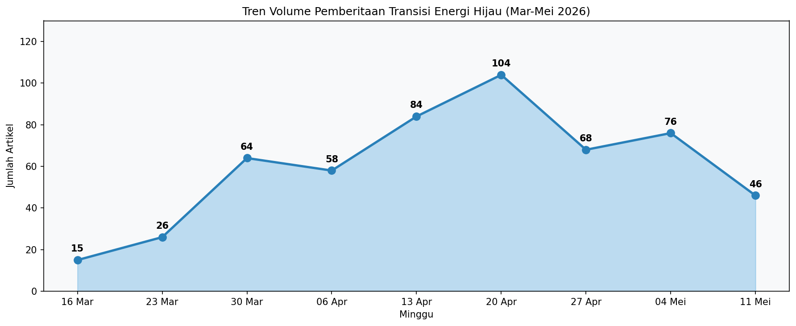
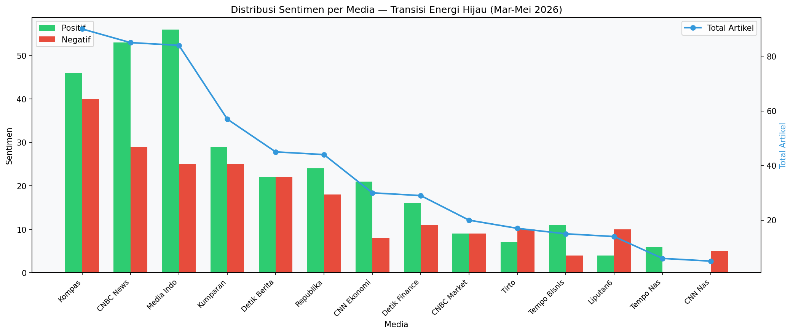
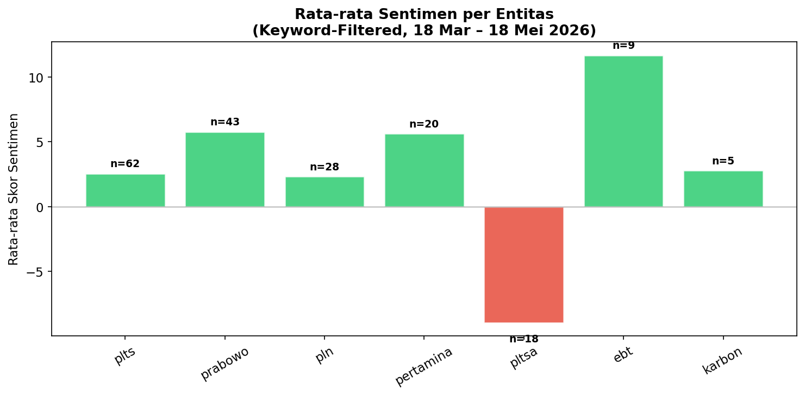
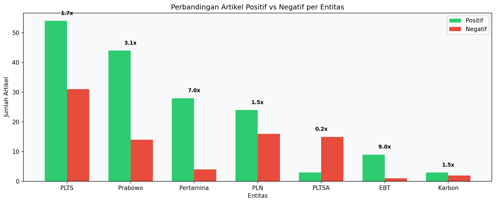

# Transisi Energi Hijau di Indonesia

**Periode:** 18 Maret – 18 Mei 2026
**Sumber:** Semantik API (12 keyword-filtered dengan `topic_keywords`)
**Kata kunci:** transisi energi, energi hijau, EBT, energi baru terbarukan, energi surya, geothermal, PLTS, PLTA, biomassa, cofiring, CCS, karbon

---

## Ringkasan

Dari **542 artikel** dari 14 media nasional (2 bulan), pemberitaan transisi energi hijau didominasi oleh **PLTS** (62 artikel, sentimen +2.57) — didorong oleh target ambisius Prabowo 100 GW PLTS, ekspansi PLN IP ke Bangladesh (495 MW), dan deregulasi atap PLTS.

**PLTSA menonjol sebagai outlier negatif** (−8.95, 18 artikel) — satu-satunya entitas dengan sentimen sangat negatif, terkait kontroversi PLTSA Jakarta, kekhawatiran sampah, dan kritik pengamat UI.

Pertamina mendapat sentimen positif (+5.65, 20 artikel) karena diversifikasi hijau (PGE panas bumi, Pertamina NRE ekspansi Bangladesh, LanzaTech). Prabowo diframing sangat positif (+5.79) sebagai penggerak utama transisi energi.

---

## Sorotan

| Entitas | Artikel (keyword-filtered) | Sentimen | P/N/Neu | Tema Framing Utama |
|---------|:------------------------:|:--------:|:-------:|--------------------|
| **PLTS** | 62 | +2.57 | 54/31/4 | Target 100 GW Prabowo, ekspor Bangladesh 495 MW, deregulasi atap |
| **Prabowo** | 43 | +5.79 | 44/14/0 | Target PLTS 100 GW, diplomasi energi Jepang-Rusia |
| **PLN** | 28 | +2.32 | 24/16/1 | Cofiring biomassa, SPKLU, PLTS Pulau Tunda |
| **Pertamina** | 20 | +5.65 | 28/4/2 | PGE geothermal, NRE Bangladesh, LanzaTech, PROPER emas |
| **PLTSA** | 18 | **−8.95** | 3/15/1 | Sampah Jakarta, 3R terabaikan, kontroversi lingkungan |
| **EBT** | 9 | +11.7 | 9/1/0 | Akselerasi EBT, RI-Rusia, KEEN garap PLTA |
| **Karbon** | 5 | +2.80 | 3/2/0 | Pasar karbon pulp & kertas, Bank Mandiri kredit karbon |
| **Geothermal** | 0 | — | — | Tidak ada pemberitaan dalam konteks keyword |

---

## 1. Volume & Sumber

542 artikel dari 14 media nasional dalam 2 bulan. Volume tertinggi: **Kompas** (90), **CNBC News** (85), **Media Indonesia** (85).

| Media | Artikel | P/N/N/Neu | Top Entities |
|-------|:------:|:-----:|--------------|
| Kompas | 90 | 46P/40N/4Neu | Indonesia, debt collector, PLTSA, pemerintah |
| CNBC News | 85 | 53P/29N/3Neu | PLTS, Prabowo, Indonesia, RI |
| Media Indonesia | 85 | 57P/25N/3Neu | PLTS, Prabowo, pemerintah daerah |
| Kumparan | 57 | 29P/25N/3Neu | PLTS, Pertamina, PLN, Indonesia |
| Detik Berita | 45 | 22P/22N/1Neu | Eddy Soeparno, Prabowo, PLTS rusak |
| Republika | 44 | 24P/18N/2Neu | PLTS, RI-Rusia, Indonesia-UNEP |
| CNN Ekonomi | 30 | 21P/8N/1Neu | PLN, Pertamina, BAP |
| Detik Finance | 29 | 16P/11N/2Neu | Prabowo, PLTS |
| CNBC Market | 20 | 9P/9N/2Neu | OJK, PLTS atap |
| Tirto | 17 | 7P/10N/0Neu | Pemerintah, OJK |
| Tempo Bisnis | 15 | 11P/4N/0Neu | PLTS Bangladesh, PLN |
| Liputan6 News | 14 | 4P/10N/0Neu | Polisi (noise) |
| Tempo Nasional | 6 | 6P/0N/0Neu | Pertamina, EBT |
| CNN Nasional | 5 | 0P/5N/0Neu | Bali, debt collector noise |

> **Catatan noise:** Beberapa artikel non-energi ikut tertangkap karena keyword matching broad (misal artikel "debt collector" yang kebetulan mengandung kata "karbon" atau "motor").

### Tren Mingguan

```
16 Mar — 15 art  (awal periode)
23 Mar — 26 art  (meningkat)
30 Mar — 64 art  (lonjakan)
06 Apr — 58 art
13 Apr — 84 art  (puncak kedua)
20 Apr — 104 art 🏆 PUNCAK TERTINGGI
27 Apr — 68 art  (turun)
04 Mei — 76 art
11 Mei — 54 art
18 Mei — 46 art
```

Volume pemberitaan puncak pada minggu **20 April** (104 artikel) — bertepatan dengan pengumuman target PLTS 100 GW Prabowo dan ekspansi PLN IP ke Bangladesh [⁰](#).



---

## 2. Tren Sentimen & Entitas







### PLTS — Dominan Positif (+2.57)
- **54 positif**, 31 negatif, 4 netral — 62 artikel, 32 hari berbeda
- Framing utama: target 100 GW, ekspor Bangladesh 495 MW, deregulasi pemasangan atap
- [PLN IP teken kerja sama Bay Group untuk PLTS 495 MW di Bangladesh](https://kumparan.com/kumparanbisnis/pln-indonesia-power-bakal-bangun-plts-495-mw-di-bangladesh-27P7VqGOnrn) ([Tempo](https://bisnis.tempo.co/read/2103759/pln-indonesia-power-bidik-proyek-plts-495-mw-di-bangladesh), [Kompas](https://money.kompas.com/read/2026/05/15/111200826/pln-ip-ekspansi-ke-bangladesh-incar-proyek-plts-495-mw))
- [Prabowo menargetkan PLTS 100 GW dengan investasi USD 100 miliar](https://kumparan.com/tony-socmed/satgas-transisi-energi-dan-komitmen-presiden-prabowo-wujudkan-kedaulatan-energi-26y4cwkeUnO) — realisasi dipercepat
- [RI-Korea Selatan sepakati bisnis energi hijau](https://www.cnbcindonesia.com/news/20260401174717-4-723315/oleh-oleh-prabowo-ri-korea-selatan-sepakati-bisnis-energi-hijau)
- [RI punya potensi energi hijau berlimpah, ini kendalanya](https://www.cnbcindonesia.com/news/20260428140354-4-730575/ri-punya-potensi-energi-hijau-berlimpah-ini-kendalanya)
- Co-occurs with: Prabowo (16), pembangkit listrik tenaga surya (12), pemerintah (11), Indonesia (10), 100 GW (8), PLN (8)

### PLTSA — Sangat Negatif (−8.95)
- **Hanya 3 positif, 15 negatif** — outlier negatif paling mencolok
- Framing: "PLTSA tak cukup atasi sampah Jakarta", "3R terabaikan"
- [Pengamat UI mengkritik kebijakan PLTSA tanpa penguatan pemilahan sampah](https://megapolitan.kompas.com/read/2026/05/15/11550521/pemprov-dki-diminta-tetap-prioritaskan-program-3r-meski-bakal-bangun) — Kompas
- [Pramono Anung optimistis stok sampah Bantargebang cukupi kebutuhan PLTSA](https://mediaindonesia.com/megapolitan/886939/pramono-anung-optimistis-stok-sampah-bantargebang-cukupi-kebutuhan-pltsa) (sentimen −34, artikel paling negatif)
- Malondong (Anies) dan Pemprov DKI jadi sorotan
- Co-occurs with: Jakarta, sampah, bantargebang, pemprov DKI

### Prabowo — Sangat Positif (+5.79)
- 44 positif, 14 negatif, 0 netral — 43 artikel, 22 hari berbeda
- Framing: pemimpin transisi energi, target PLTS 100 GW, kunjungan ke Jepang & Rusia
- [Satgas Transisi Energi dan komitmen Presiden Prabowo](https://kumparan.com/tony-socmed/satgas-transisi-energi-dan-komitmen-presiden-prabowo-wujudkan-kedaulatan-energi-26y4cwkeUnO) — sentimen +28
- [Oleh-oleh Prabowo: RI-Korea Selatan sepakati bisnis energi hijau](https://www.cnbcindonesia.com/news/20260401174717-4-723315/oleh-oleh-prabowo-ri-korea-selatan-sepakati-bisnis-energi-hijau) — CNBC News
- Bahlil mendapat arahan dari Prabowo untuk akselerasi EBT

### Pertamina — Positif (+5.65)
- 28 positif, 4 negatif, 2 netral — 20 artikel
- Framing: [PGE perkuat peran panas bumi](https://mediaindonesia.com/ekonomi/890180/panas-bumi-terus-diperkuat-sebagai-penopang-transisi-energi-rendah-karbon) sebagai penopang transisi energi rendah karbon
- [Pertamina NRE jajaki investasi energi hijau Bangladesh](https://bisnis.tempo.co/read/2104007/pertamina-nre-jajaki-investasi-energi-hijau-bangladesh) — Tempo
- [Laba PGE (PGEO) tembus 137 juta dolar AS](https://money.kompas.com/read/2026/04/24/134000126/laba-pertamina-geothermal-energy-pgeo-tembus-137-juta-dollar-as-sinyal-positif) — sentimen +29 (artikel paling positif)
- LanzaTech jalin MoU untuk solusi energi rendah karbon
- PROPER emas dan hijau — borong 14 proper emas dan 108 hijau

### PLN — Positif Sedang (+2.32)
- 24 positif, 16 negatif, 1 netral — 28 artikel
- Framing: [cofiring biomassa 25 PLTU](https://money.kompas.com/read/2026/05/12/164314826/6-jurus-den-jaga-ketahanan-energi-modernisasi-kilang-hingga-percepatan-ebt), PLTS Pulau Tunda (rusak → [dibangun baru 2027](https://news.detik.com/berita/d-8488033/pemprov-banten-ungkap-plts-rusak-di-pulau-tunda-bakal-dibangun-baru-pln-2027))
- [PLN luncurkan Smart and Green Building](https://www.cnnindonesia.com/ekonomi/20260511175100-625-1357566/pln-luncurkan-smart-and-green-building-lebih-efisien-dan-rendah-emisi) — lebih efisien dan rendah emisi
- SPKLU untuk mudik Lebaran, berencana pensiunkan 2139 PLTD di 741 lokasi

### EBT — Sangat Positif (+11.7) tapi Volume Rendah
- Hanya 9 artikel — pemberitaan EBT masih minim
- [Kencana Energi (KEEN) garap PLTA Rp 2,03 Triliun di Sumut](https://money.kompas.com/read/2026/05/15/060615226/emiten-ebt-kencana-energi-keen-garap-plta-rp-203-triliun-di-sumut) — Kompas
- [RI-Rusia perluas kerja sama nuklir, LNG, dan EBT](https://ekonomi.republika.co.id/berita/tf0smh416/setelah-hulu-migas-rirusia-perluas-kerja-sama-nuklir-lng-dan-ebt) — Republika
- [Pimpinan MPR bertemu Dubes UEA bahas energi terbarukan](https://nasional.kompas.com/read/2026/04/15/14035251/pimpinan-mpr-bertemu-dubes-uea-bahas-pengembangan-energi-terbarukan) — Kompas

### Karbon — Netral Positif (+2.80)
- 5 artikel — volume sangat rendah
- [Industri pulp dan kertas bidik RI jadi pemain utama perdagangan karbon global](https://kumparan.com/kumparanbisnis/industri-pulp-dan-kertas-bidik-ri-jadi-pemain-utama-perdagangan-karbon-global-27OYYDNJtp6) — Kumparan
- [Indonesia dan UNEP perkuat kerja sama pasar karbon kehutanan](https://esgnow.republika.co.id/berita/tf09a8522/indonesia-dan-unep-perkuat-kerja-sama-pasar-karbon-kehutanan) — Republika
- [RI punya kalkulator hijau jilid II](https://www.cnbcindonesia.com/market/20260512133624-17-734397/ri-kini-punya-kalkulator-hijau-jilid-ii-bisa-hitung-emisi-karbon-cs) — CNBC Market
- [Imperialisme hijau: kritik terhadap cara Eropa "mencuci" dosa karbon](https://kumparan.com/devandianisa3/imperialisme-hijau-cara-eropa-mencuci-dosa-karbon-melalui-negara-berkembang-27LurQxiz79) — Kumparan

### Geothermal, Cofiring, PLTA — Tidak Ada Pemberitaan
- Ketiga entitas mencatat 0 artikel dalam konteks keyword yang difilter
- Menunjukkan bahwa pemberitaan geothermal dan cofiring belum masuk arus utama, meskipun jadi andalan Kementerian ESDM

---

## 3. Bagaimana Media Membingkai Berita

### Framing per Entitas

| Entitas | Framing Dominan |
|---------|----------------|
| **PLTS** | Positif-ekonomis: ekspansi Bangladesh 495 MW, target 100 GW, investasi USD 100 miliar. **Media:** Tempo Bisnis, Kompas, CNBC — framing ekspansif. |
| **PLTSA** | Negatif-kritis: sampah Jakarta, 3R terabaikan, kritik pengamat. **Media:** Kompas — framing skeptis. |
| **PLN** | Campuran: cofiring biomassa sebagai solusi hijau (+) vs PLTS Pulau Tunda yang rusak (−). **Media:** CNN Ekonomi, Detik Berita. |
| **Pertamina** | Positif-institusional: diversifikasi hijau, PROPER, LanzaTech, ekspansi NRE. **Media:** Tempo Nasional, CNN Ekonomi, Kumparan. |
| **Prabowo** | Positif-kepemimpinan: visi 100 GW PLTS, "realisasi dipercepat", diplomasi energi Jepang-Rusia. **Media:** CNBC News, Media Indonesia, Detik Finance. |
| **EBT** | Positif-peluang: akselerasi EBT, kerja sama internasional, KEEN. **Media:** Kompas, Republika. |
| **Karbon** | Opik-peluang: pasar karbon global, Bank Mandiri kredit karbon, kalkulator hijau. **Media:** Kumparan, Republika. |

### Perbedaan Framing per Media

- **Kompas** (90 artikel): Paling berimbang — memberitakan [PLTSA secara kritis](https://megapolitan.kompas.com/read/2026/05/15/11550521/pemprov-dki-diminta-tetap-prioritaskan-program-3r-meski-bakal-bangun), PLTS secara optimistis. Paling banyak meliput kebijakan ([WFH ASN hemat Rp 10 T](https://money.kompas.com/read/2026/05/15/123000826/wfh-asn-diklaim-bisa-hemat-rp-10-t-bappenas-masih-uji-efektivitas)).
- **CNBC News** (85): Paling pro-bisnis — fokus pada [investasi](https://www.cnbcindonesia.com/news/20260401174717-4-723315/oleh-oleh-prabowo-ri-korea-selatan-sepakati-bisnis-energi-hijau), [target PLTS Prabowo](https://www.cnbcindonesia.com/news/20260428140354-4-730575/ri-punya-potensi-energi-hijau-berlimpah-ini-kendalanya), dan peluang ekspor.
- **Media Indonesia** (85): Berimbang — menyoroti [transformasi tambang hijau](https://mediaindonesia.com/ekonomi/890721/teknologi-penyimpanan-energi-bisa-percepat-transformasi-tambang-hijau), [panas bumi](https://mediaindonesia.com/ekonomi/890180/panas-bumi-terus-diperkuat-sebagai-penopang-transisi-energi-rendah-karbon), dan [perdagangan karbon](https://mediaindonesia.com/ekonomi/891361/indonesia-gerak-cepat-akomodasi-perdagangan-karbon-kehutanan).
- **Kumparan** (57): Paling beragam — dari [PLTS Bangladesh](https://kumparan.com/kumparanbisnis/pln-indonesia-power-bakal-bangun-plts-495-mw-di-bangladesh-27P7VqGOnrn) hingga [geopolitik lithium](https://kumparan.com/agnes-pryzynta-ujung/energi-hijau-konflik-baru-perebutan-lithium-di-balik-transisi-global-27Nb0TUVJxb) dan [pasar karbon](https://kumparan.com/kumparanbisnis/industri-pulp-dan-kertas-bidik-ri-jadi-pemain-utama-perdagangan-karbon-global-27OYYDNJtp6).
- **Detik Berita** (45): Fokus pada tokoh — Eddy Soeparno soal CCS, [PLTS rusak Pulau Tunda](https://news.detik.com/berita/d-8488033/pemprov-banten-ungkap-plts-rusak-di-pulau-tunda-bakal-dibangun-baru-pln-2027).
- **Republika** (44): Fokus internasional — [kerja sama RI-Rusia](https://ekonomi.republika.co.id/berita/tf0smh416/setelah-hulu-migas-rirusia-perluas-kerja-sama-nuklir-lng-dan-ebt), [Indonesia-UNEP](https://esgnow.republika.co.id/berita/tf09a8522/indonesia-dan-unep-perkuat-kerja-sama-pasar-karbon-kehutanan).

---

## 4. Pemain-Pemain Penting

### Pemerintah & Politik

| Pemain | Peran | Sentimen | Detail |
|--------|------|---------|--------|
| **Prabowo** | Presiden RI | +5.79 | Penggerak utama target 100 GW PLTS, "realisasi dipercepat", [diplomasi energi ke Jepang, Korea, dan Rusia](https://www.cnbcindonesia.com/news/20260401174717-4-723315/oleh-oleh-prabowo-ri-korea-selatan-sepakati-bisnis-energi-hijau) |
| **Bahlil Lahadalia** | Menteri ESDM | −2.00 | Rombak 19 pejabat ESDM Ditjen EBTKE, kritik Eropa balik ke batu bara |
| **Eddy Soeparno** | Wakil Ketua MPR | — | Dorong RI jadi hub CCS Asia-Pasifik, bicara di Asia Carbon Capture 2026 |
| **Airlangga Hartarto** | Menko Perekonomian | — | Paparkan kerja sama Indonesia-Jepang di AZEC Summit |

### BUMN & Perusahaan Energi

| Pemain | Peran | Detail |
|--------|------|--------|
| **PLN** (+ PLN IP) | BUMN listrik | [Cofiring biomassa 25 PLTU](https://money.kompas.com/read/2026/05/12/164314826/6-jurus-den-jaga-ketahanan-energi-modernisasi-kilang-hingga-percepatan-ebt), [PLTS 495 MW Bangladesh](https://kumparan.com/kumparanbisnis/pln-indonesia-power-bakal-bangun-plts-495-mw-di-bangladesh-27P7VqGOnrn), [SPKLU mudik](https://www.cnnindonesia.com/ekonomi/20260511175100-625-1357566/pln-luncurkan-smart-and-green-building-lebih-efisien-dan-rendah-emisi), pensiunkan 2139 PLTD |
| **Pertamina** (+ PGE, NRE) | BUMN energi | [PGE perkuat panas bumi](https://mediaindonesia.com/ekonomi/890180/panas-bumi-terus-diperkuat-sebagai-penopang-transisi-energi-rendah-karbon), [NRE jajaki Bangladesh](https://bisnis.tempo.co/read/2104007/pertamina-nre-jajaki-investasi-energi-hijau-bangladesh), [laba PGEO tembus 137 juta dolar](https://money.kompas.com/read/2026/04/24/134000126/laba-pertamina-geothermal-energy-pgeo-tembus-137-juta-dollar-as-sinyal-positif) |
| **Kencana Energi (KEEN)** | Emiten EBT publik | [Garap PLTA Rp 2,03 Triliun di Sumut](https://money.kompas.com/read/2026/05/15/060615226/emiten-ebt-kencana-energi-keen-garap-plta-rp-203-triliun-di-sumut) |
| **DOGO Power** | Perusahaan energi | Pamer di Indonesia International Coal & Energy Exhibition 2026 |
| **Bay Group** | Mitra Bangladesh | [Kerja sama dengan PLN IP untuk PLTS 495 MW](https://kumparan.com/kumparanbisnis/pln-ip-teken-kerja-sama-bay-group-incar-proyek-plts-495-mw-di-bangladesh-27OHPkt6YrD) |
| **LanzaTech** | Perusahaan teknologi karbon | MoU dengan Pertamina untuk solusi energi rendah karbon |

### Lembaga & Organisasi

| Lembaga | Peran | Detail |
|---------|------|--------|
| **UNEP** | PBB | [Perkuat kerja sama pasar karbon kehutanan dengan Indonesia](https://esgnow.republika.co.id/berita/tf09a8522/indonesia-dan-unep-perkuat-kerja-sama-pasar-karbon-kehutanan) |
| **OJK** | Regulator keuangan | Dibahas dalam konteks PLTS atap, [kalkulator hijau](https://www.cnbcindonesia.com/market/20260512133624-17-734397/ri-kini-punya-kalkulator-hijau-jilid-ii-bisa-hitung-emisi-karbon-cs), dan pembiayaan hijau |
| **Bappenas** | Perencanaan pembangunan | [Uji efektivitas WFH ASN untuk penghematan energi](https://money.kompas.com/read/2026/05/15/123000826/wfh-asn-diklaim-bisa-hemat-rp-10-t-bappenas-masih-uji-efektivitas) — klaim hemat Rp 10 T |
| **Pemprov DKI** | Pemerintah daerah | [Diminta prioritaskan 3R atas PLTSA](https://megapolitan.kompas.com/read/2026/05/15/11550521/pemprov-dki-diminta-tetap-prioritaskan-program-3r-meski-bakal-bangun) — kritik pengamat UI |
| **Pemprov Banten** | Pemerintah daerah | [Ungkap PLTS Pulau Tunda rusak sejak 2018](https://news.detik.com/berita/d-8488033/pemprov-banten-ungkap-plts-rusak-di-pulau-tunda-bakal-dibangun-baru-pln-2027) |
| **UI (Universitas Indonesia)** | Akademisi | Pengamat UI kritik PLTSA tanpa penguatan 3R |

---

## 5. Temuan Kunci

1. **PLTS mendominasi pemberitaan transisi energi** — 62 artikel, sentimen +2.57, 32 hari berbeda. Didorong oleh [target ambisius 100 GW (Prabowo)](https://kumparan.com/tony-socmed/satgas-transisi-energi-dan-komitmen-presiden-prabowo-wujudkan-kedaulatan-energi-26y4cwkeUnO) dan [ekspor ke Bangladesh (PLN IP)](https://kumparan.com/kumparanbisnis/pln-indonesia-power-bakal-bangun-plts-495-mw-di-bangladesh-27P7VqGOnrn).

2. **PLTSA adalah outlier negatif (−8.95)** — satu-satunya entitas yang mendapat sentimen sangat negatif. [Kontroversi PLTSA Jakarta](https://megapolitan.kompas.com/read/2026/05/15/11550521/pemprov-dki-diminta-tetap-prioritaskan-program-3r-meski-bakal-bangun) jadi sorotan karena dianggap mengabaikan program 3R dan pemilahan sampah.

3. **Prabowo sebagai motor utama** — 43 artikel dalam konteks energi hijau, sentimen +5.79, diframing sebagai pemimpin yang mendorong [target ambisius](https://www.cnbcindonesia.com/news/20260401174717-4-723315/oleh-oleh-prabowo-ri-korea-selatan-sepakati-bisnis-energi-hijau) dengan frasa "realisasi dipercepat".

4. **Geothermal (0 artikel), cofiring (0 artikel), dan PLTA (0 artikel) tidak masuk pemberitaan** — meskipun jadi andalan Kementerian ESDM, pemberitaan ketiga topik ini nyaris tidak ada dalam 2 bulan terakhir.

5. **Pertamina melakukan diversifikasi hijau** — [PGE (panas bumi)](https://mediaindonesia.com/ekonomi/890180/panas-bumi-terus-diperkuat-sebagai-penopang-transisi-energi-rendah-karbon), [Pertamina NRE (ekspansi internasional)](https://bisnis.tempo.co/read/2104007/pertamina-nre-jajaki-investasi-energi-hijau-bangladesh), [laba PGEO tembus 137 juta dolar](https://money.kompas.com/read/2026/04/24/134000126/laba-pertamina-geothermal-energy-pgeo-tembus-137-juta-dollar-as-sinyal-positif), dan PROPER emas.

6. **Pasar karbon masih niche** — hanya 5 artikel tentang karbon dalam 2 bulan. Fokus: [industri pulp & kertas](https://kumparan.com/kumparanbisnis/industri-pulp-dan-kertas-bidik-ri-jadi-pemain-utama-perdagangan-karbon-global-27OYYDNJtp6), [Bank Mandiri](https://kumparan.com/devandianisa3/imperialisme-hijau-cara-eropa-mencuci-dosa-karbon-melalui-negara-berkembang-27LurQxiz79), dan [UNEP](https://esgnow.republika.co.id/berita/tf09a8522/indonesia-dan-unep-perkuat-kerja-sama-pasar-karbon-kehutanan).

7. **Kompas adalah media paling komprehensif** — 90 artikel, memberitakan PLTS (positif) dan PLTSA (kritis) secara seimbang. CNBC News dan Media Indonesia paling pro-investasi.

8. **Sentimen Bahlil negatif (−2.00)** — framing seputar rombakan pejabat ESDM dan kritik terhadap Eropa, bukan tentang prestasi energi hijau.

---

## 6. Keterbatasan

- `articles/search` telah dipaginasi penuh — semua 542 artikel tersedia di `data/articles_list.json`
- Keyword matching masih menghasilkan noise ("debt collector", "polisi", "motor")
- `framing/{word}/by-source` masih bermasalah untuk beberapa entitas — fallback ke `framing/{word}`
- `relations/network` bersifat cross-channel — tidak 100% spesifik topik

---

## Data

- `data/source_comparison.json` — per-media breakdown (542 artikel, 14 sumber)
- `data/topic_trend.json` — volume mingguan (10 minggu)
- `data/bulk_sentiment.json` — sentimen agregat per entitas
- `data/entity_data/*.json` — sentiment, timeline, dan co-occurrence per entitas
- `data/framing_data.json` — framing phrases per entitas
- `data/relations_actor_{name}.json` — data aktor untuk PLTS, PLN, Pertamina, Prabowo, Bahlil, ESDM
- `data/relations_network.json` — network graph
- `data/articles_list.json` — 50 artikel teratas (dari 542)

---

*Dibuat dengan Semantik API. 18 Mar – 18 Mei 2026. Semua endpoint entity-level menggunakan `topic_keywords` untuk akurasi topik.*