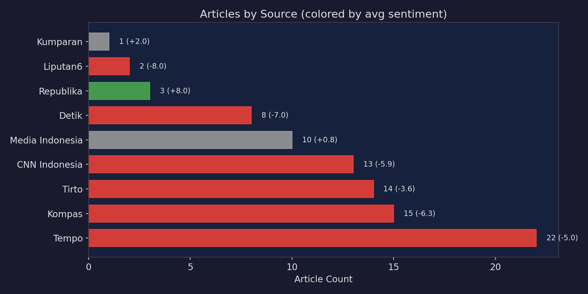
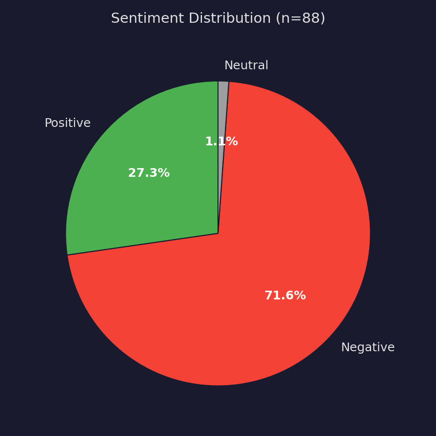
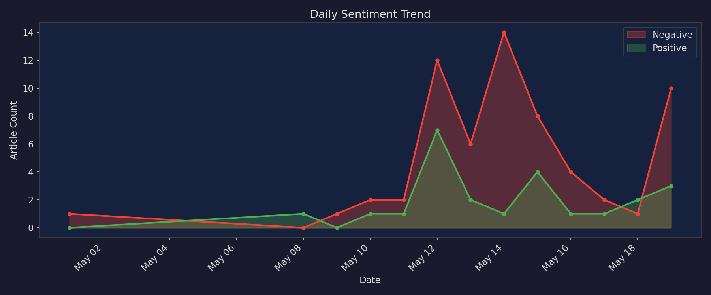
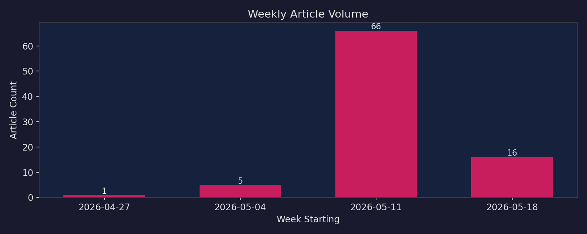
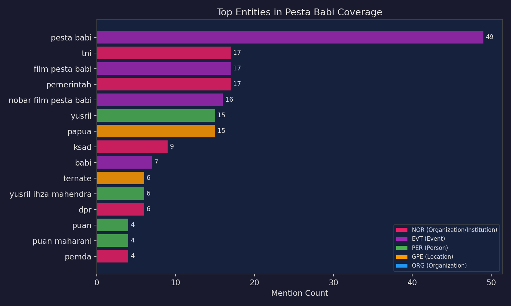
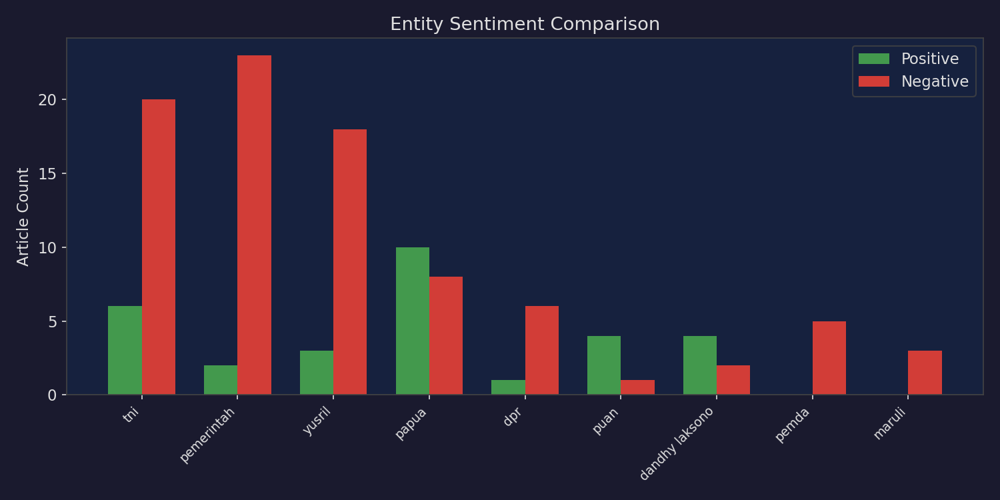
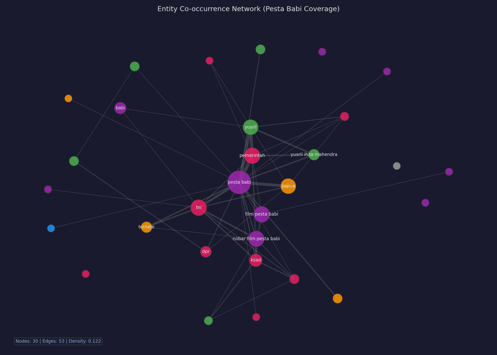
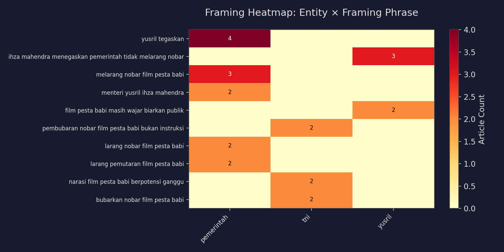

# Analisis Pemberitaan Film Dokumenter "Pesta Babi"

**Tanggal:** 2026-05-20
**Periode Data:** 1 Mei – 20 Mei 2026
**Sumber Data:** [Semantik Research API](https://semantik.cc) — Channel Lingkungan (keyword-scoped)
**Kata Kunci:** `pesta babi`

---

## Ringkasan Eksekutif

Film dokumenter **"Pesta Babi"** karya Dandhy Dwi Laksono menjadi pusat polemik nasional setelah nonton bareng (nobar) di berbagai daerah dibubarkan oleh aparat. **88 artikel** dari **9 sumber berita nasional** memberitakan kontroversi ini dalam kurun 1–20 Mei 2026.

**Tiga temuan utama:**

1. **72% sentimen negatif** — liputan didominasi pemberitaan tentang pembubaran, kritik terhadap kebebasan berekspresi, dan tuduhan keterlibatan militer
2. **Puncak pemberitaan minggu 11–17 Mei** — 66 artikel (75% dari total) dipicu oleh pembubaran nobar di Ternate dan pernyataan KSAD Maruli Simanjuntak
3. **Dua narasi yang bentrok** — pemerintah pusat (Yusril) menegaskan tidak melarang film; TNI dan pemerintah daerah mengklaim pembubaran demi keamanan

## Latar Belakang

"Pesta Babi" adalah film dokumenter yang mengangkat konflik lahan dan masyarakat adat di Papua. Judulnya merujuk pada ritual pesta babi dalam budaya adat Papua yang memiliki makna spiritual dan sosial. Film ini hanya bisa ditonton melalui nobar resmi (*nonton bareng*), bukan platform streaming.

Kontroversi dimulai ketika nobar di berbagai daerah — termasuk Ternate, Bandung, dan Bali — dibubarkan oleh aparat dengan alasan keamanan dan ketidaksesuaian prosedur perizinan. KSAD Jenderal Maruli Simanjuntak menyatakan pembubaran adalah keputusan pemerintah daerah, bukan instruksi TNI. Menko Kumham Imipas Yusril Ihza Mahendra menegaskan pemerintah tidak pernah melarang film tersebut.

---

## Data Science Analytics

### Volume Pemberitaan per Sumber



| Sumber | Artikel | Rata-rata Sentimen |
|---|---|---|
| **Tempo** | 22 | −4.95 |
| **Kompas** | 15 | −6.27 |
| **Tirto** | 14 | −3.57 |
| **CNN Indonesia** | 13 | −5.92 |
| **Media Indonesia** | 10 | +0.80 |
| **Detik** | 8 | −7.00 |
| **Republika** | 3 | +8.00 |
| **Liputan6** | 2 | −8.00 |
| **Kumparan** | 1 | +2.00 |

**Observasi:** Tempo memiliki volume tertinggi (22 artikel) dengan sentimen negatif. Republika dan Media Indonesia adalah satu-satunya sumber dengan sentimen rata-rata positif. Sumber dengan sentimen paling negatif adalah Liputan6 (−8.0) dan Detik (−7.0).

### Distribusi Sentimen



- **Positif:** 24 artikel (27%)
- **Negatif:** 63 artikel (72%)
- **Netral:** 1 artikel (1%)

Dominasi sentimen negatif mencerminkan pemberitaan yang berfokus pada kontroversi: pembubaran paksa, tuduhan pelanggaran kebebasan berekspresi, serta ketegangan antara institusi negara.

### Tren Sentimen Harian



**Poin-poin penting:**
- 12 Mei 2026 — puncak volume (19 artikel), didorong oleh pernyataan Puan Maharani dan DPD RI yang mengkritik pembubaran
- 14 Mei 2026 — sentimen negatif tertinggi (14 artikel negatif), dipicu pernyataan Yusril yang memicu perdebatan publik
- 19 Mei 2026 — gelombang baru pemberitaan saat KSAD memberikan klarifikasi

### Tren Volume Mingguan



| Pekan | Artikel | Keterangan |
|---|---|---|
| 27 Apr – 3 Mei | 1 | Artikel awal (pengumuman film) |
| 4–10 Mei | 5 | Mulai ada liputan nobar |
| **11–17 Mei** | **66** | **PUNCAK — pembubaran massal + reaksi tokoh** |
| 18–20 Mei | 16 | Klarifikasi KSAD + respons lanjutan |

### Analisis Frekuensi Entitas



**Entitas paling sering disebut:**

| Entitas | Grup | Jumlah | Peran |
|---|---|---|---|
| `pesta babi` | EVT | 49 | Film/subjek pemberitaan |
| `tni` | NOR | 17 | Institusi militer — aktor pembubaran |
| `film pesta babi` | EVT | 17 | Film sebagai subjek |
| `pemerintah` | NOR | 17 | Pemerintah pusat — diwakili Yusril |
| `nobar film pesta babi` | EVT | 16 | Acara nonton bareng |
| `yusril` | PER | 15 | Menko Kumham Imipas — tokoh utama pemerintah |
| `papua` | GPE | 15 | Lokasi/is cerita film |
| `ksad` | NOR | 9 | Kepala Staf AD — penegas pembubaran oleh pemda |
| `dpr` | NOR | 6 | DPR RI — merespons kontroversi |
| `puan` / `puan maharani` | PER | 4 | Ketua DPR RI |
| `dandhy laksono` | PER | 4 | Sutradara film |
| `pemda` | NOR | 4 | Pemerintah daerah — pelaksana pembubaran |
| `ternate` | GPE | 6 | Lokasi pembubaran nobar |

**Sumber:** [Search entities API](https://semantik.cc/api/search/entities?q=pesta+babi)

### Perbandingan Sentimen per Entitas



| Entitas | Positif | Negatif | Skor Rata-rata | Interpretasi |
|---|---|---|---|---|
| **Pemerintah** | 2 | 23 | −8.88 | Paling negatif — pemerintah disorot karena pembubaran |
| **DPR** | 1 | 6 | −8.86 | DPR dikritik karena merespons lamban |
| **Pemda** | 0 | 5 | −8.20 | Eksekutor pembubaran |
| **Yusril** | 3 | 18 | −7.95 | Tokoh kontroversial — bicara soal penjajahan Papua |
| **Maruli** | 0 | 3 | −4.67 | Klarifikasi skorsial, sentimen tetap negatif |
| **TNI** | 6 | 20 | −3.23 | Sentimen terbagi — ada yang pro keamanan, banyak kritik |
| **Papua** | 10 | 8 | −0.47 | Netral — lebih sebagai lokasi/is cerita |
| **Dandhy Laksono** | 4 | 2 | −0.17 | Sutradara — sentimen agak positif |
| **Puan** | 4 | 1 | +4.00 | Paling positif — disebut merespons dengan baik |

**Sumber:** [Bulk sentiment API](https://semantik.cc/api/entities/bulk-sentiment?entities=yusril,maruli,puan,papua,tni,dpr,dandhy+laksono,pemerintah,pemda&topic_keywords=pesta+babi&date_from=2026-05-01&date_to=2026-05-20)

---

## Social Network Analysis

### Jaringan Ko-okurensi Entitas



**Metrik jaringan:**
- **30** simpul (entitas unik)
- **53** tepi (hubungan ko-okurensi)
- **Densitas:** 0.122 (relatif padat — entitas saling terhubung erat)

**Temuan struktural:**

1. **Pemerintah sebagai jembatan** — `pemerintah` (NOR) menghubungkan `yusril` (PER) dengan `tni` (NOR) dan `pemda` (NOR), mencerminkan dinamika tiga tingkat: pusat → militer → daerah
2. **Dua kluster utama:** aktor pemerintah (Yusril, pemerintah, DPR, Puan) vs aktor keamanan (TNI, KSAD, Kodam, Pemda) — keduanya terhubung melalui `pesta babi` sebagai simpul pusat
3. **Tokoh kunci:** `yusril` dan `tni` adalah penghubung (*bridge nodes*) antara institusi sipil dan militer
4. **Papua sebagai lokus geografis** — `papua` dan `ternate` adalah satu-satunya simpul GPE yang muncul, menegaskan fokus geografis pemberitaan pada Papua dan Maluku Utara

**Sumber:** [Network co-occurrence API](https://semantik.cc/api/network/cooccurrence?topic_keywords=pesta+babi&date_from=2026-05-01&date_to=2026-05-20)

### Relasi Aktor-Aksi (SVO)

| Aktor | Aksi | Target | Jumlah |
|---|---|---|---|
| TNI | membubarkan | nobar film pesta babi | ×2 |
| TNI | membubarkan | nobar pesta babi | ×1 |
| TNI | membubarkan | aksi nobar | ×1 |
| TNI | membubarkan | nonton bareng (nobar) | ×1 |
| TNI | mengingatkan potensi gangguan dari | pesta babi | ×1 |
| TNI | menilai memiliki risiko tinggi mengganggu stabilitas | pesta babi | ×1 |
| Maruli | menjelaskan aksi pembubaran | nobar pesta babi | ×1 |

**Sumber:** Relations endpoint (maruli, tni)

**Pola dominan:** TNI sebagai subjek pembubaran (5 dari 7 SVO triple). Maruli muncul sebagai *explainer*, bukan pelaku langsung — konsisten dengan klaimnya bahwa pembubaran adalah keputusan pemda.

---

## Content / Framing Analysis

### Matriks Framing



### Framing per Aktor

| Entitas | Framing Dominan | Narasi |
|---|---|---|
| **Yusril** | "Pemerintah tidak melarang nobar" (×3), "Film masih wajar, biarkan publik" (×2) | **Defensif-legalistik:** Pemerintah di sisi kebebasan berekspresi, pembubaran bukan kebijakan pusat |
| **TNI** | "Pembubaran bukan instruksi TNI" (×2), "Narasi berpotensi ganggu keharmonisan" (×2) | **Keamanan-stabilitas:** Film dinilai tendensius, pembubaran demi ketertiban |
| **Pemerintah** | "Yusril tegaskan" (×4), "Melarang nobar" (×3) | **Pusat vs daerah:** Pemerintah pusat dilepaskan dari keputusan pembubaran |
| **Papua** | "Konflik lahan dan masyarakat adat" (×1), "Budaya adat memicu kritik HAM" (×1) | **Isu substantif:** Isi film tentang Papua, bukan sekadar kontroversi |
| **Puan / DPR** | "Menilai judul sensitif" (×1), "Kritik sah tapi perlu tanggung jawab etik" (×1) | **Hati-hati:** Mengakui kritik tapi tidak sepenuhnya membela film |
| **Maruli** | "Aksi pembubaran" (×1), "Koordinasi dan keputusan pemda" (×1) | **Delegasi:** Tanggung jawab dialihkan ke pemerintah daerah |

**Sumber:** [Framing compare API](https://semantik.cc/api/framing/compare?entities=yusril,maruli,puan,papua,tni,pemerintah,dpr&topic_keywords=pesta+babi&date_from=2026-05-01&date_to=2026-05-20)

### Analisis Framing Mendalam

**Dua narasi yang saling bertabrakan:**

1. **Narasi Pemerintah Pusat (Yusril):** "Pemerintah tidak melarang, ini keputusan daerah." Yusril secara konsisten menyatakan tidak ada arahan atau kebijakan dari pusat untuk membubarkan nobar. Ia menegaskan Papua adalah bagian dari RI dan pemerintah tidak pernah menjajah Papua. Framing ini bertujuan memisahkan pemerintah pusat dari tindakan kontroversial aparat daerah.

2. **Narasi Keamanan (TNI/KSAD/Pemda):** "Pembubaran demi keamanan, bukan instruksi pusat." TNI melalui Kodam XVII/Cenderawasih menyatakan narasi film berpotensi mengganggu keharmonisan sosial di Papua. KSAD Maruli menambahkan bahwa pembubaran adalah hasil koordinasi dan keputusan pemda, dengan pertimbangan risiko keamanan.

**Framing yang hilang:** Tidak ada framing dari perspektif masyarakat adat Papua atau pembela HAM yang muncul di framing data — meskipun artikel Tirto dan Kompas menuliskan perspektif tersebut dalam editorial/analisis mereka.

---

## Artikel Kunci (dengan URL Sumber)

| Tanggal | Sumber | Judul | URL |
|---|---|---|---|
| 19 Mei | CNN Indonesia | KSAD Klaim Pembubaran Nobar Pesta Babi Arahan Pemda | [URL](https://www.cnnindonesia.com/nasional/20260519160545-20-1360057/ksad-klaim-pembubaran-nobar-pesta-babi-arahan-pemda) |
| 19 Mei | Republika | Bantah Beri Instruksi Pembubaran Nobar, KSAD Maruli Pertanyakan Pendanaan Film 'Pesta Babi' | [URL](https://news.republika.co.id/berita/tfacd1409/bantah-beri-instruksi-pembubaran-nobar-ksad-maruli-pertanyakan-pendanaan-film-pesta-babi) |
| 19 Mei | Detik | Menko Yusril: Papua Bagian dari RI, Pemerintah Tak Pernah Jajah | [URL](https://news.detik.com/berita/d-8495686/menko-yusril-papua-bagian-dari-ri-pemerintah-tak-pernah-jajah) |
| 19 Mei | Tempo | KSAD: Tak Ada Instruksi Membubarkan Nobar Film Pesta Babi | [URL](https://nasional.tempo.co/read/2104382/ksad-tak-ada-instruksi-membubarkan-nobar-film-pesta-babi) |
| 19 Mei | Kumparan | Polemik Film Pesta Babi, Haedar: Jangan Sampai Pesan Justru Tak Sampai Tujuan | [URL](https://kumparan.com/kumparannews/polemik-film-pesta-babi-haedar-jangan-sampai-pesan-justru-tak-sampai-tujuan-27QiJxaN3mI) |
| 16 Mei | Kompas | Kontroversi Film "Pesta Babi": Pemerintah Tegaskan Tak Larang, TNI Ingatkan Potensi Gangguan | [URL](https://nasional.kompas.com/read/2026/05/16/10310071/kontroversi-film-pesta-babi-pemerintah-tegaskan-tak-larang-tni-ingatkan) |
| 15 Mei | Kompas | TNI Sebut Narasi Film "Pesta Babi" Berpotensi Ganggu Keharmonisan Sosial Papua | [URL](https://nasional.kompas.com/read/2026/05/15/16535421/tni-sebut-narasi-film-pesta-babi-berpotensi-ganggu-keharmonisan-sosial-papua) |
| 15 Mei | Kompas | Kontroversi Nobar Film Pesta Babi, Pemerintah dan DPR Tegaskan Tak Ada Larangan | [URL](https://nasional.kompas.com/read/2026/05/15/11173631/kontroversi-nobar-film-pesta-babi-pemerintah-dan-dpr-tegaskan-tak-ada) |
| 14 Mei | Kompas | Yusril Tegaskan Pemerintah Tak Pernah Larang Nobar Film Pesta Babi | [URL](https://nasional.kompas.com/read/2026/05/14/15581991/yusril-tegaskan-pemerintah-tak-pernah-larang-nobar-film-pesta-babi) |
| 13 Mei | Kompas | DPD RI Nilai Pembubaran Nobar Film Pesta Babi Coreng Kebebasan Berekspresi | [URL](https://nasional.kompas.com/read/2026/05/13/19165421/dpd-ri-nilai-pembubaran-nobar-film-pesta-babi-coreng-kebebasan-berekspresi) |
| 13 Mei | Kompas | Pesta Babi dan Ketakutan atas Narasi | [URL](https://nasional.kompas.com/read/2026/05/13/08380051/pesta-babi-dan-ketakutan-atas-narasi) |
| 12 Mei | Kompas | Soal Film Pesta Babi, Pigai Sebut Larangan Nobar Harus Lewat Putusan Pengadilan | [URL](https://nasional.kompas.com/read/2026/05/12/14462051/soal-film-pesta-babi-pigai-sebut-larangan-nobar-harus-lewat-putusan) |
| 12 Mei | Tirto | Komnas HAM Desak Aparat Jamin Keamanan Pemutaran Film Pesta Babi | [URL](https://tirto.id/komnas-ham-desak-aparat-jamin-keamanan-pemutaran-film-pesta-babi-hv6F) |
| 12 Mei | Tirto | TNI Klaim Bubarkan Nobar Pesta Babi Imbas Tak Berizin & Isu SARA | [URL](https://tirto.id/tni-klaim-bubarkan-nobar-pesta-babi-imbas-tak-berizin-isu-sara-hv1P) |
| 12 Mei | Tirto | Puan Soal Larangan Nobar Film Pesta Babi: Akan Ditindaklanjuti | [URL](https://tirto.id/puan-soal-larangan-nobar-film-pesta-babi-akan-ditindaklanjuti-hv1S) |
| 11 Mei | Tirto | Apa Isi Film Dokumenter Pesta Babi Sampai Nobarnya Dibubarkan? | [URL](https://tirto.id/apa-isi-film-dokumenter-pesta-babi-sampai-nobarnya-dibubarkan-hvVS) |

---

## Analisis Framing — Detail per Artikel

### Kutipan Langsung dari Artikel

> **KSAD Maruli Simanjuntak:** "Pembubaran nonton bareng (nobar) film 'Pesta Babi' bukan instruksi TNI, melainkan keputusan pemerintah daerah dengan pertimbangan keamanan."
> — [CNN Indonesia, 19 Mei 2026](https://www.cnnindonesia.com/nasional/20260519160545-20-1360057/ksad-klaim-pembubaran-nobar-pesta-babi-arahan-pemda)

> **Menko Yusril:** "Pemerintah tidak pernah mengeluarkan arahan ataupun kebijakan pelarangan pemutaran film Pesta Babi. Pemerintah tak pernah menjajah Papua."
> — [Detik, 19 Mei 2026](https://news.detik.com/berita/d-8495686/menko-yusril-papua-bagian-dari-ri-pemerintah-tak-pernah-jajah)

> **Kodam XVII/Cenderawasih:** Narasi film "Pesta Babi" dinilai tendensius dan berpotensi mengganggu keharmonisan sosial di Papua.
> — [Kompas, 15 Mei 2026](https://nasional.kompas.com/read/2026/05/15/16535421/tni-sebut-narasi-film-pesta-babi-berpotensi-ganggu-keharmonisan-sosial-papua)

> **Anggota DPR Azis Subekti:** "Kritik terhadap pembangunan Papua itu sah, tetapi harus beretika dan tidak menggiring persepsi."
> — [Kompas, 14 Mei 2026](https://nasional.kompas.com/read/2026/05/14/15322801/soal-film-pesta-babi-anggota-dpr-kritik-sah-tetapi-perlu-tanggung-jawab-etik)

> **Menteri HAM Natalius Pigai:** Larangan nobar film harus berdasar putusan pengadilan.
> — [Kompas, 12 Mei 2026](https://nasional.kompas.com/read/2026/05/12/14462051/soal-film-pesta-babi-pigai-sebut-larangan-nobar-harus-lewat-putusan)

> **DPD RI:** Pembubaran dan intimidasi terhadap nobar film dokumenter Pesta Babi melanggar jaminan kebebasan berekspresi.
> — [Kompas, 13 Mei 2026](https://nasional.kompas.com/read/2026/05/13/19165421/dpd-ri-nilai-pembubaran-nobar-film-pesta-babi-coreng-kebebasan-berekspresi)

---

## Keterbatasan Analisis (Limitations)

1. **Keyword matching vs NLP count:** Data `articles/search` menggunakan pencocokan teks luas (judul/ringkasan mengandung "pesta babi"). Entity-level data (bulk sentiment, framing) menggunakan NLP, sehingga jumlahnya bisa berbeda.
2. **Periode pendek (20 hari):** Pemberitaan masih berlangsung aktif. Analisis ini adalah *snapshot* awal.
3. **Tidak semua artikel terbaca penuh:** Analisis framing didasarkan pada judul, ringkasan, dan framing phrase dari API NLP — bukan pembacaan penuh setiap artikel.
4. **Cakupan terbatas pada channel Lingkungan:** Data berasal dari channel Lingkungan Semantik (yang mencakup nikel, batubara, tambang, dll). Keyword-scoping dengan `topic_keywords=pesta+babi` memastikan hanya artikel relevan yang diambil.
5. **Kemungkinan lag data 1 hari:** Semantik menjalankan pipeline harian; artikel hari ini mungkin belum masuk.

---

## Kode Analisis (Reproducible)

Script analisis tersedia di `scripts/analysis.py`:

```bash
# Install dependencies
pip install matplotlib networkx numpy

# Run from research directory
cd research/2026-05-20-pesta-babi
python3 scripts/analysis.py
```

Script ini memuat data dari `data/` (JSON mentah), menghasilkan semua chart ke `charts/`, dan mencetak laporan terstruktur ke stdout.

### Data Mentah

Semua data API tersimpan dalam `data/`:
- `source_comparison.json` — perbandingan sumber
- `sentiment_distribution.json` — distribusi sentimen
- `sentiment_trend.json` — tren harian sentimen
- `topic_trend.json` — volume mingguan
- `top_entities.json` — entitas teratas
- `bulk_sentiment.json` — sentimen per entitas
- `network_cooccurrence.json` — jaringan ko-okurensi
- `framing_compare.json` — perbandingan framing
- `framing_*.json` — framing per entitas
- `rel_*.json` — relasi SVO per aktor
- `all_articles.json` — seluruh artikel (88 item)

---

## Metodologi

**Endpoint API yang digunakan:**
- `articles/search?keywords=pesta+babi` — pencarian artikel (dengan pagination offset=0,50)
- `aggregated/source-comparison?topic_keywords=pesta+babi` — perbandingan sumber
- `sentiment/distribution?topic_keywords=pesta+babi` — distribusi sentimen
- `sentiment/trend?topic_keywords=pesta+babi&interval=daily` — tren harian
- `aggregated/topic-trend?keywords=pesta+babi&interval=weekly` — tren mingguan
- `entities/top?topic_keywords=pesta+babi` — entitas teratas
- `entities/bulk-sentiment` — sentimen batch untuk 9 entitas
- `network/cooccurrence?topic_keywords=pesta+babi` — jaringan ko-okurensi
- `framing/compare` — perbandingan framing antar entitas
- `framing/{word}` — framing per entitas
- `relations/actor/{entity}` — relasi SVO

**Periode:** 1 Mei 2026 – 20 Mei 2026
**Token:** SEMANTIK_RESEARCH_API_KEY (environment variable)
**Tool:** Semantik Research API + Hermes Agent + Python (matplotlib, networkx, numpy)